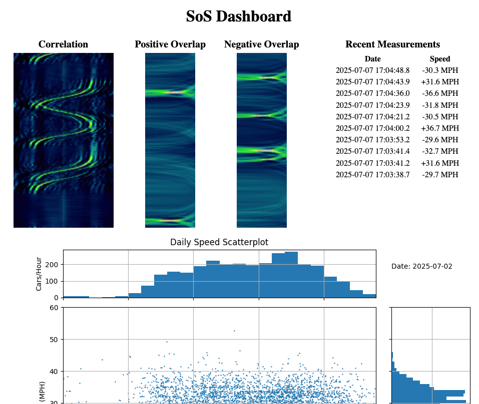

<h1 align="center"> </h1>
<h1 align="center">Sound of Speed</h1>

Automobile traffic monitor using acoustic microphones and Raspberry Pi Zero 2W, 3A or B, 4 or 5.

## Introduction
This project uses two ordinary microphones connected to a Raspberry Pi computer to measure the speed of traffic from the side of a two-lane road.  This system is useful for gathering statistics of traffic speeds and volume over a long period of time.

### Features:
- Low cost of hardware consisting of: a Raspberry Pi computer, two identical microphones in all-weather enclosures facing a roadway, and a two-channel stereo microphone to USB converter
- Logging of vehicle speed, direction, and time of day into a SQL database file
- Integrated web server to display statistical results on any local web browser

### Background
A description of the principle of operation is available [here](https://hackaday.io/project/190670-sound-of-speed).
This system is limited to a two-lane roadway with each lane traveling in opposite directions.  The tire noise made by a moving vehicle is picked up by the microphones and tracked as it passes by.  The computer calculates the speed of each vehicle and logs the time of day but does not identify the individual vehicle. Because each setup has slightly different microphone positioning, the user needs to configure the software with the horizontal spacing between the left and right microphones (30 to 100 cm) and the distance from the microphones to the roadway (5 to 50 meters).


This system uses precise measurements of time delay of the road noise measured between the two microphones.  As a result it is required that a single STEREO USB converter is used and not two separate microphones each with a different USB port.  Generally a two-channel microphone pre-amplifier is needed to boost the signals from the microphones to the stereo input adapter.

## Hardware Requirements
- Computer: Raspberry Pi Zero 2W, 3A, 3B, 4, or 5 should all work.  This code is tested using a Pi Zero 2W and operates comfortably.
- USB stereo microphone adapter.  A single, stereo adapter is required to ensure both microphones are sampled at the same time.  Additionally, for long-term use the microphones should each be placed in a weather-tolerant housing to protect the microphones from the elements.  PVC pipe or "Loc-Line" hoses work acceptably.
- Local network access for the Raspberry Pi and display device to view results via web browser.
- Internet access for Raspberry Pi during initial installation and during use to provide correct time of day.

## Installing / Getting started

These installation instructions assume a freshly installed Raspian Bookworm __Lite__ installation.  The __Lite__ version of the OS is best because there is a conflict between this audio processing code and the audio utility _pulseaudio_ which is included in the _Desktop_ version of the OS.

First, perform a test to ensure the OS recognizes the audio capture device with the ALSA command:
```
arecord -l
```
The computer should list all available audio input devices including the intended stereo microphone adapter.

Once the computer is configured with network access, open an SSH shell into the computer and execute the following install script from the user directory:

```shell
curl -s https://raw.githubusercontent.com/gregory-whaley/sound_of_speed/sos_master/config/pre_installer.sh | bash
```

The script will collect and install all the required libraries and then reboot.  The Sound of Speed system automatically starts upon booting.


### Initial Configuration
The user must update and save the configuration text file using, for example, the command:

```shell
nano ~/sos_master/sos_capture/sos.config
```

The soundcard sampling rate must be updated in the config file to match the highest rate allowed by the audio adapter, either 44100 or 48000 samples per second are acceptable.  The user must measure the distance between microphones (in meters) and include that on the appropriate line.  

The distance from the microphones to each lane of the roadway (in meters) must also be updated.  One lane of traffic will be considered a "positive" speed for either left to right or right to left motion for a given orientation of the two microphones (left and right).  Swapping the microphone positions will flip the positive speed measurement to a negative speed measurement, and vice versa.  

Because the speed of sound is related to the air temperature, the `sos.config` file also has an entry for setting the outside air temperature in degrees C.

After updating the `sos.config` file, the computer must be re-booted.

## Operation
  The speed display and statistics are available via web browser at:

```
http://hostname.local/
```
where `hostname` is the name of the Raspberry Pi computer which is assigned with the OS install.  Note that `https://` is not supported at this time. 

 Here is a screenshot of an example measurement:


The Correlation plot shows the angle of the sound sources over time, the Overlap plots show the results of the vehicle detection scoring algorithm.  A peak in the detection score signifies an "event" and a speed measurement is computed from the peak.  New updated statistical charts are generated each day at midnight

Additionally, the results are reported via an MQTT service on the Raspberry Pi at port 1883.  You may subscribe to the following topics:
- /SoS/log
- /SoS/speed
- /SoS/velocity

The data is stored in SQL format on the computer in the path `sos_master/sos_capture/speed.db`.

## Support

If you have trouble installing or operating this system, please feel free to leave an issue entry on GitHub.  This is pre-beta software and there are likely to be bugs.


## Links


- Project homepage: :https://hackaday.io/project/190670-sound-of-speed/
- Repository: https://github.com/gregory-whaley/sound_of_speed/
- Issue tracker: https://github.com/gregory-whaley/sound_of_speed/issues


## Licensing

The code in this project is licensed under MIT license.

Copyright (c) 2025 Gregory Whaley

Permission is hereby granted, free of charge, to any person obtaining a copy
of this software and associated documentation files (the "Software"), to deal
in the Software without restriction, including without limitation the rights
to use, copy, modify, merge, publish, distribute, sublicense, and/or sell
copies of the Software, and to permit persons to whom the Software is
furnished to do so, subject to the following conditions:

The above copyright notice and this permission notice shall be included in all
copies or substantial portions of the Software.

THE SOFTWARE IS PROVIDED "AS IS", WITHOUT WARRANTY OF ANY KIND, EXPRESS OR
IMPLIED, INCLUDING BUT NOT LIMITED TO THE WARRANTIES OF MERCHANTABILITY,
FITNESS FOR A PARTICULAR PURPOSE AND NONINFRINGEMENT. IN NO EVENT SHALL THE
AUTHORS OR COPYRIGHT HOLDERS BE LIABLE FOR ANY CLAIM, DAMAGES OR OTHER
LIABILITY, WHETHER IN AN ACTION OF CONTRACT, TORT OR OTHERWISE, ARISING FROM,
OUT OF OR IN CONNECTION WITH THE SOFTWARE OR THE USE OR OTHER DEALINGS IN THE
SOFTWARE.
